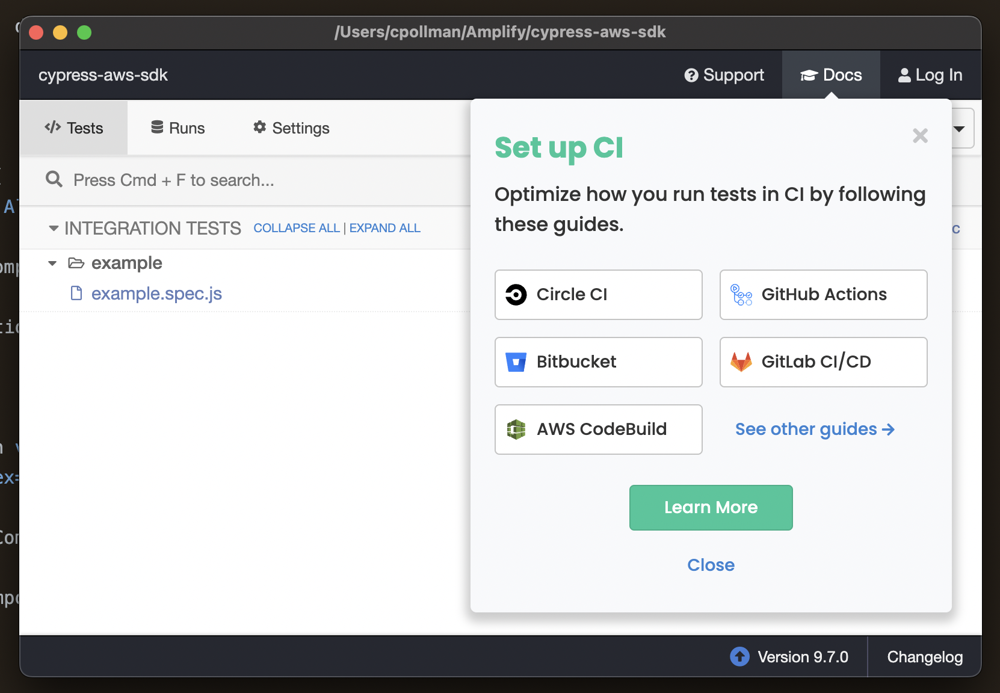

# Example Repo For Reproducing an Issue with the AWS SDK and Cypress

Directions to reproduce issue

1. Clone this repo:

```sh
git clone git@github.com:calebpollman/cypress-aws-sdk.git
```

1. Enter example repo:

```sh
cd cypress-aws-sdk
```

1. Install deps via `npm`:

```sh
npm i
```

1. Run example app:

```sh
npm run start
```

1. Start Cypress in a second terminal from the root directory:

```sh
npm run e2e
```

1. In the Cypress window, press the `example.spec.js` link to run the test:


